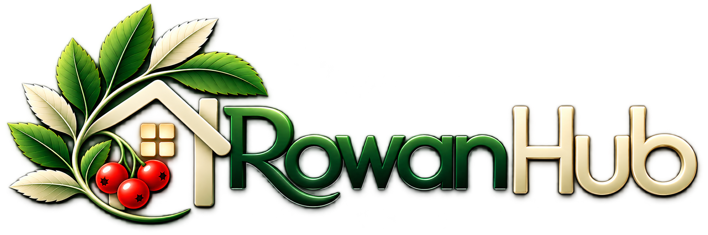

# Rowan Hub

A self-hosted Matter bridge that connects your smart home devices to Apple Home, Google Home, and Amazon Alexa — simultaneously, with a single QR code scan.

Rowan Hub runs locally on any Linux machine, handles its own device polling and state management, and provides a clean web UI for configuration, logging, and system management.

---

## Why Rowan Hub

Most smart home bridges lock you into one ecosystem. Rowan Hub uses the open Matter standard so your devices appear in all three major platforms at once — no cloud dependency, no skill certification, no integration config.

- **Pair once** — one QR code commissions to every platform at the same time
- **Runs locally** — no cloud required for device control
- **No Alexa skill needed** — Matter bridges work natively without publishing
- **Devices, scenes, and automations** — managed in one place, visible everywhere

---

## Stack

| Layer | Technology |
|---|---|
| Runtime | Node.js 20+ |
| Matter bridge | @matter/main 0.17.x |
| Web UI | Express + EJS |
| Process manager | PM2 |
| mDNS | avahi-daemon |
| Config | YAML |

---

## Supported plugins

| Plugin | Protocol | Local | Cloud | Capabilities |
|---|---|---|---|---|
| **WLED** | HTTP + WebSocket | ✅ | — | power, brightness, colour, presets |
| **Tasmota** | HTTP REST | ✅ | — | power |
| **eWeLink** | Cloud API v2 + LAN | ⚠️ | ✅ | power (single + multi-channel) |
| **Shelly** | HTTP REST (Gen1) / WebSocket JSON-RPC (Gen2) | ✅ | — | power, brightness |
| **MQTT** | MQTT pub/sub | ✅ | — | configurable (power, temperature, humidity, …) |
| **Zigbee2MQTT** | MQTT (auto-discovers capabilities via Z2M) | ✅ | — | power, brightness, colour temp, temperature, humidity, contact, motion |
| **Daikin** | HTTP REST (legacy firmware only) | ✅ | — | power, temperature, target temperature, HVAC mode |

---

## Capability → Matter device type

Rowan Hub maps plugin capabilities to Matter device types automatically:

| Capabilities | Matter device type |
|---|---|
| power | On/Off Plug-in Unit |
| power + brightness | Dimmable Light |
| power + brightness + color | Extended Color Light (HS + colour temperature) |
| power + brightness + colorTemp | Color Temperature Light |
| temperature (sensor only) | Temperature Sensor |
| humidity (sensor only) | Humidity Sensor |
| contact | Contact Sensor |
| motion | Occupancy Sensor |
| hvacMode / targetTemperature | On/Off switch (full Thermostat cluster — TODO) |
| WLED presets | One On/Off switch per preset |

---

## Installation

### Prerequisites

- Node.js 20+
- PM2 (`npm install -g pm2`)
- avahi-daemon (`apt install avahi-daemon`)

```bash
git clone git@github.com:ArchiveHunter/rowan-hub.git
cd rowan-hub
npm install
cp config.example.yaml config.yaml
# Edit config.yaml with your bridge settings, devices, and credentials
pm2 start ecosystem.config.js
pm2 save
pm2 startup
```

### avahi-daemon

Rowan Hub relies on avahi for mDNS so Matter controllers can discover the bridge on the local network. Without it, commissioning will fail.

```bash
sudo apt install avahi-daemon
sudo systemctl enable avahi-daemon
sudo systemctl start avahi-daemon
```

---

## Configuration

Copy `config.example.yaml` to `config.yaml` and edit it. The file is gitignored — your credentials stay local.

### Bridge

```yaml
bridge:
  name: Rowan Hub
  passcode: 20202021   # 8-digit pairing code — choose any number (avoid 11111111, 22222222, etc.)
  discriminator: 3840  # 0–4095, used for mDNS discovery; change if running multiple bridges on the same network
  port: 5540           # Matter UDP port (default 5540; must be unique per bridge on the host)
```

`passcode` is the code you enter (or that the QR code encodes) when commissioning with a platform. `discriminator` distinguishes this bridge from others during discovery. Neither needs to change after commissioning unless you reset the bridge.

### UI

```yaml
ui:
  port: 3088
```

### Plugin global settings

Only include sections for plugins you actually use:

```yaml
ewelink:
  username: "your@email.com"
  password: "yourpassword"
  region: "eu"   # eu | us | as | cn

mqtt:
  broker: "mqtt://192.168.1.5"
  username: ""   # optional
  password: ""   # optional

zigbee2mqtt:
  broker: "mqtt://192.168.1.5"
  topic_prefix: "zigbee2mqtt"   # default
```

### Plugin enable/disable

```yaml
plugins:
  wled:         { enabled: true }
  tasmota:      { enabled: true }
  ewelink:      { enabled: true }
  shelly:       { enabled: false }
  mqtt:         { enabled: false }
  zigbee2mqtt:  { enabled: false }
  daikin:       { enabled: false }
```

This can also be toggled from the Plugins page in the web UI.

### Devices

```yaml
devices:
  # WLED LED strip — presets appear as individual switches
  - plugin: wled
    id: living-room-wall
    name: Living Room Wall
    host: 192.168.1.100
    presets:
      - Standard
      - Rainbow
      - Off

  # Tasmota smart plug
  - plugin: tasmota
    id: front-socket
    name: Front Socket
    host: 192.168.1.101

  # eWeLink single-channel (MINIR4 etc.)
  - plugin: ewelink
    id: driveway-lights
    name: Driveway Lights
    device_id: "100278564d"

  # eWeLink multi-channel (TX2C) — one entry per channel
  - plugin: ewelink
    id: downlights
    name: Downlights
    device_id: "100102920d"
    channel: 0

  - plugin: ewelink
    id: pendants
    name: Pendants
    device_id: "100102920d"
    channel: 1

  # Shelly relay (Gen1 or Gen2 — auto-detected)
  - plugin: shelly
    id: hallway-dimmer
    name: Hallway Dimmer
    host: 192.168.1.102
    generation: auto   # auto | 1 | 2
    component: light   # relay | light | roller
    channel: 0

  # Generic MQTT device
  - plugin: mqtt
    id: garden-sensor
    name: Garden Sensor
    topic_prefix: home/garden-sensor
    capabilities: temperature, humidity

  # Zigbee2MQTT device
  - plugin: zigbee2mqtt
    id: office-motion
    name: Office Motion
    device_name: office_motion_sensor   # Z2M friendly name

  # Daikin AC (legacy firmware only)
  - plugin: daikin
    id: living-room-ac
    name: Living Room AC
    host: 192.168.1.103
```

#### Disabling individual devices

Any device can be disabled without removing it from the config:

```yaml
  - plugin: tasmota
    id: christmas-tree
    name: Christmas Tree
    host: 192.168.1.110
    enabled: false   # skipped at startup; not visible to any platform
```

Disabled devices can be toggled on or off from the Devices page in the web UI. Enabling takes effect immediately without a restart.

---

## Plugin details

### WLED

Connects via WebSocket for real-time state and HTTP for preset discovery. Presets listed in config appear as individual switches — mutually exclusive (selecting one turns off the others).

Find preset names in the WLED web UI under Presets.

### Tasmota

Polls `http://{host}/cm?cmnd=Power` every 5 seconds. Works with any single-relay Tasmota device.

Multi-gang devices are supported — add one entry per channel, set `channel: 1`, `channel: 2`, etc.

### eWeLink

Uses the eWeLink cloud API (v2). Single-channel devices (MINIR4 etc.) and multi-channel devices (TX2C) are both supported. For multi-channel, add one config entry per channel with the same `device_id` and a `channel` field (0-based).

Device IDs are in the eWeLink app: tap the device → edit icon → scroll to Device ID.

LAN control is supported if you provide `host` and `device_key`. Commands go via LAN first; if the device is unreachable it falls back to cloud and logs a one-line warning.

### Shelly

Auto-detects Gen1 vs Gen2 by probing the device. Gen1 uses HTTP REST polling; Gen2 uses a persistent WebSocket JSON-RPC connection with push notifications. Both support multi-channel — set `channel` to the outlet index (0-based).

### MQTT

Generic MQTT driver. State arrives as JSON on `{topic_prefix}/state`; commands are published as JSON to `{topic_prefix}/set`.

State JSON keys:
- `on` → power (boolean)
- `temperature` → °C (number)
- `humidity` → % (number)

Set `capabilities` in the device config as a comma-separated list to tell Rowan Hub what Matter device types to expose.

### Zigbee2MQTT

Connects to the same MQTT broker as Z2M. Capabilities are auto-discovered from `zigbee2mqtt/bridge/devices` — no manual capability list needed for known Z2M devices.

State topic: `zigbee2mqtt/{device_name}`
Command topic: `zigbee2mqtt/{device_name}/set`

Requires Zigbee2MQTT running with a compatible USB coordinator (CC2652, Sonoff Zigbee Dongle Plus, etc.).

### Daikin

Supports legacy Daikin WiFi adapters (BRP069Axx series) using the classic HTTP key-value API. **Do not update the firmware** — versions 2.8.0+ change the API entirely and are not supported.

Exposes a switch representing HVAC on/off. Full thermostat cluster support (target temperature, mode) is planned for a later iteration.

---

## Web UI

Rowan Hub serves two endpoints:

| URL | Purpose |
|---|---|
| `http://{host}:3088` | Local network access |
| `https://{host}:3443` | HTTPS — required for push notifications and PWA install on phones |

A self-signed TLS certificate is generated automatically on first start and saved alongside the project (gitignored). Your browser will show a security warning the first time — this is expected for a self-signed cert on a local server.

**To trust the certificate on iOS (recommended for PWA install):**
1. Open `https://{host}:3443` in Safari
2. Tap **Show Details → visit this website** to bypass the warning
3. Go to **Settings → General → VPN & Device Management** → find the Rowan Hub certificate → tap **Trust**
4. Refresh — the warning will be gone permanently for this device

**To install as a home screen app on iPhone/iPad:**
- Open `https://{host}:3443` in Safari → **Share → Add to Home Screen**
- Must be HTTPS — the HTTP address does not support PWA install or push notifications

If you have a proper domain certificate (e.g. from Let's Encrypt), you can point Rowan Hub at it instead of using the self-signed cert:

```yaml
ui:
  port: 3088
  httpsPort: 3443
  certFile: /etc/letsencrypt/live/yourdomain/fullchain.pem
  keyFile:  /etc/letsencrypt/live/yourdomain/privkey.pem
```

| Page | What it does |
|---|---|
| **Dashboard** | Live device state, power toggles, brightness sliders, colour picker, preset buttons |
| **Devices** | Add, edit, remove, and enable/disable devices |
| **Plugins** | Enable/disable plugins, edit global credentials |
| **Scenes** | Create named scenes; scenes appear as switches on all paired platforms |
| **Automations** | Time-based and sunrise/sunset automation rules |
| **Logs** | Streaming log console |
| **System** | Bridge commissioning info, QR code, pairing window, push notifications, live stats, Restart button |

---

## Commissioning

### First platform

When Rowan Hub starts for the first time (or after a commission reset), a QR code is displayed in the System page of the web UI and printed to the log output. Scan it with any compatible app:

| Platform | App |
|---|---|
| Apple | Home app — tap + → Add Accessory |
| Google | Google Home app — tap + → Set up device → Matter |
| Amazon | Alexa app — Devices → + → Add Device → Matter |

If you can't scan the QR code, you can enter the passcode manually:
1. Open the commissioning flow in your app
2. Choose "Enter code manually" or similar
3. Enter the 8-digit passcode from `config.yaml`

### Adding a second or third platform

Once the bridge is commissioned by one platform, it is no longer in open commissioning mode. To add another platform (e.g. Alexa after Apple Home is already set up):

1. Open the web UI → **System**
2. Click **Open for pairing** — this opens a 15-minute commissioning window and starts the bridge advertising on the network
3. Open the commissioning flow in the second app and scan the QR code shown on the System page

The window closes automatically after 15 minutes or when commissioning completes. You can repeat this for each additional platform.

### Commission state

Commissioning data is stored in `matter-storage/` alongside the project. This directory is gitignored. Do not delete it while the bridge is commissioned — you would need to re-pair all platforms.

### Re-commissioning

To start fresh (wipe all paired platforms and commission again):
1. Delete the `matter-storage/` directory
2. Restart Rowan Hub — a new QR code will be printed to the logs
3. Re-scan with each platform

---

## Project structure

```
rowan-hub/
├── rowan-hub.js              # Entry point
├── config.yaml               # Your config (gitignored)
├── config.example.yaml       # Template
├── ecosystem.config.js       # PM2 config
├── matter-storage/           # Commissioning state (gitignored — do not delete while paired)
├── core/
│   ├── bridge.js             # Matter bridge (ServerNode + AggregatorEndpoint)
│   ├── registry.js           # Device registry + state
│   ├── device-builder.js     # Matter endpoint construction
│   ├── config-manager.js     # Config CRUD + plugin schemas
│   ├── ui-server.js          # Express web server + API
│   ├── push-manager.js       # Web push notifications + update checks
│   ├── logger.js             # Console patch + SSE log stream
│   └── color.js              # RGB ↔ HSL helpers
├── plugins/
│   ├── wled/
│   ├── tasmota/
│   ├── ewelink/
│   ├── shelly/
│   ├── mqtt/
│   ├── zigbee2mqtt/
│   └── daikin/
└── ui/
    ├── views/                # EJS templates
    │   └── partials/
    └── public/
        ├── css/
        └── js/
```

---

## Writing a plugin

A plugin is a directory under `plugins/` with an `index.js` that exports an async `init(config, globalConfig)` function returning a driver.

```js
const { EventEmitter } = require('events');

class MyDriver extends EventEmitter {
  constructor(config, globalConfig) {
    super();
    this.state = { on: false };
  }

  get capabilities() {
    // power | brightness | color | colorTemp
    // temperature | humidity | contact | motion
    // targetTemperature | hvacMode
    return ['power'];
  }

  get(capability) {
    if (capability === 'power') return this.state.on;
    return null;
  }

  async set(capability, value) {
    if (capability === 'power') {
      this.state.on = Boolean(value);
      // send command to device here
      this.emit('state', { ...this.state });
    }
  }

  destroy() {
    // clean up timers / connections
  }
}

module.exports = {
  async init(config, globalConfig) {
    const driver = new MyDriver(config, globalConfig);
    // start polling or connect WebSocket here
    return driver;
  },
};
```

The driver emits `'state'` whenever device state changes. Rowan Hub syncs that state to the Matter endpoint automatically. Conversely, when a Matter controller changes a device's state, Rowan Hub calls `driver.set()`.

Add the plugin schema to `core/config-manager.js` under `PLUGIN_SCHEMAS` and it will appear in the web UI's add/edit device forms automatically.

---

## Built with

- [@matter/main](https://github.com/project-chip/matter.js) — Matter SDK for Node.js
- [Express](https://expressjs.com/) — Web UI server
- [js-yaml](https://github.com/nodeca/js-yaml) — Config parsing
- [axios](https://axios-http.com/) — HTTP device communication
- [ws](https://github.com/websockets/ws) — WebSocket (WLED, Shelly Gen2)
- [mqtt](https://github.com/mqttjs/MQTT.js) — MQTT (generic MQTT, Zigbee2MQTT)
- [suncalc](https://github.com/mourner/suncalc) — Sunrise/sunset times for automations
- [web-push](https://github.com/web-push-libs/web-push) — Push notifications

---

*Rowan Hub is open source software. It is not affiliated with Apple, Google, Amazon, or any device manufacturer.*
